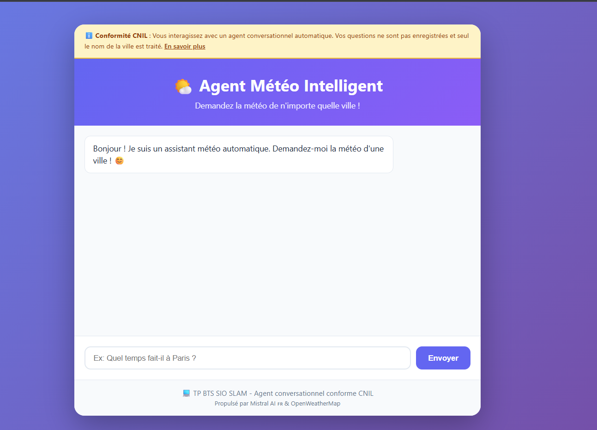
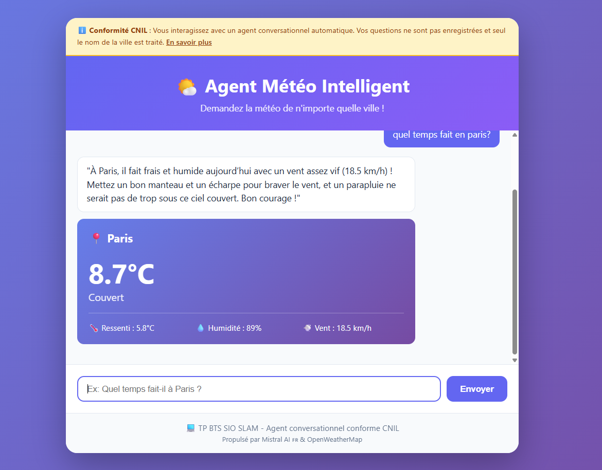
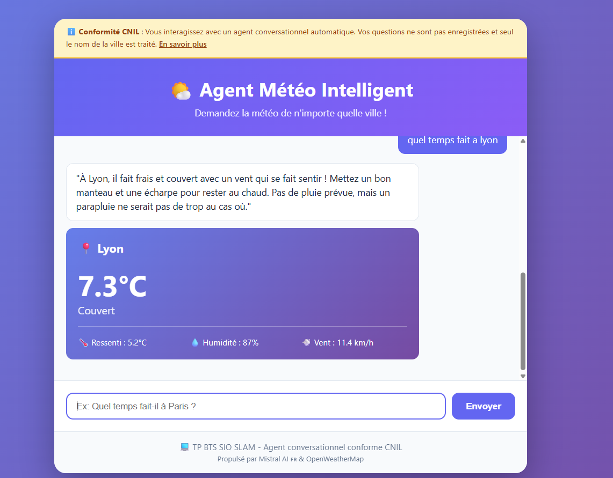

# 📄 Réponses aux questions de réflexion & QCM  
**TP – Agents conversationnels, IA responsable & Météo**

---

## 1. Sécurité et RGPD

### **Q1.1 : Pourquoi est-il important de stocker les clés API dans un fichier `.env` et pas directement dans le code ?**
Stocker les clés API dans un fichier `.env` permet :  
- d'éviter de les exposer dans le code ou sur GitHub,  
- de protéger l'accès à des services sensibles,  
- de faciliter leur rotation sans modifier l’application,  
- de respecter les bonnes pratiques de sécurité (principe du secret).

---

### **Q1.2 : Quelles données personnelles sont collectées par notre agent ? Est-ce conforme au principe de minimisation du RGPD ?**
L’agent ne collecte **que le nom de la ville**, donnée strictement nécessaire pour fournir la météo.  
➡️ Oui, cela respecte le **principe de minimisation**, car aucune autre donnée personnelle n’est collectée.

---

### **Q1.3 : Que se passerait-il si on stockait l’historique des conversations ? Quelles obligations RGPD s’appliqueraient ?**
Stocker l’historique ferait de l’agent un système de traitement de données personnelles.  
Obligations RGPD :  
- informer l’utilisateur,  
- définir une finalité précise,  
- appliquer une durée de conservation,  
- permettre l’exercice des droits (accès, suppression, rectification),  
- garantir la sécurité et le chiffrement,  
- obtenir un **consentement explicite** si l’historique n’est pas indispensable.

---

## 2. Conception conforme CNIL

### **Q2.1 : Citez 3 recommandations de la CNIL que nous avons appliquées dans ce TP.**
- Transparence : l’utilisateur est informé qu’il parle à un robot.  
- Minimisation des données collectées.  
- Pas de stockage des conversations sans consentement.  
- Sécurisation des secrets via `.env`.  
(3 suffisent)

---

### **Q2.2 : Comment l’utilisateur est-il informé qu’il parle à un robot ? Pourquoi est-ce important ?**
L’interface indique clairement que la réponse provient d’un **agent conversationnel**.  
Cela est important car :  
- c’est une **obligation CNIL**,  
- cela évite la confusion avec un humain,  
- cela renforce la transparence et la confiance.

---

### **Q2.3 : Proposez une amélioration pour ajouter une “supervision humaine”.**
Une solution possible :  
- ajouter un bouton **“Contacter un humain”**,  
- permettre à l’utilisateur d’envoyer sa question à un opérateur réel,  
- ou basculer la conversation vers un support humain.  
La CNIL recommande cela pour éviter toute décision automatisée sans contrôle humain.

---

## 3. Technique

### **Q3.1 : Expliquez le rôle de Mistral AI dans notre application.**
Mistral AI sert à :  
- **extraire automatiquement la ville** dans la phrase de l’utilisateur,  
- **générer des réponses naturelles** en langage humain.

---

### **Q3.2 : Pourquoi utilise-t-on `response_format={"type": "json_object"}` dans `extraire_ville()` ?**
Cela force le modèle à renvoyer une **réponse en JSON**, ce qui :  
- facilite la récupération programmée de la ville,  
- évite les erreurs d’interprétation,  
- rend le traitement plus robuste.

---

### **Q3.3 : Comment pourrait-on gérer plusieurs langues dans l'agent conversationnel ?**
- Détection automatique de la langue via Mistral AI.  
- Adaptation de la réponse dans cette même langue.  
- Utilisation d’un système d’internationalisation (fichiers `i18n.json`).  
- Possibilité d’utiliser un modèle multilingue.

---

#  QCM – Réponses

1. **b**  
2. **b**  
3. **b**  
4. **c**  
5. **a**  
6. **b**  
7. **c**  
8. **a**  
9. **b**  
10. **b**  
11. **b**  
12. **b**  
13. **c**  
14. **c**  
15. **c**  
16. **c**

---

##  Galerie de photos du projet

Voici les captures d’écran illustrant votre application météo :

```markdown


